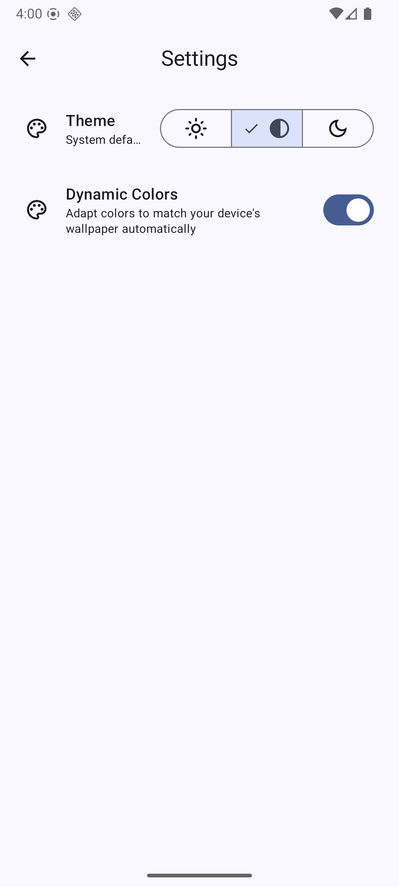

<h1 align="center">
     Meowpedia
</h1>

     A modern Android app for discovering cat breeds 🐾

  
  
  
  
  

## Features:

✅ **Offline-first**: The app works offline after the first successful data fetch. If the user launches the app for the first time while offline, they’ll see an error. All subsequent visits display previously cached data, including search results.

✅ **Favorites Support**: Users can mark and unmark breeds as favorites. Favorite status is preserved across app restarts and shown consistently in both the breed list and detail screens.

✅ **Dynamic Theming**: Users can toggle between light and dark modes, and enable dynamic color theming based on their device wallpaper (Android 12+). Preferences are stored locally and persist across sessions.

✅ **Pull-to-Refresh**: Users can refresh the breed list by swiping down. If the user is offline, a friendly error snackbar appears.

✅ **Real-Time Search**: Breed names can be searched in real time with debounced input. Users only need to type part of a breed's name.

✅ **Rich Details**: Tapping a breed opens a detail screen with its name, origin, lifespan, and a full-screen image. A button allows users to view the breed's Wikipedia page within the app via a custom tab.

✅ **Broad Compatibility**: Meowpedia supports devices running Android 5.0 (API 21) and up, ensuring wide accessibility.

## Known Issues:

❗**Exponential backoff** for retrying failed API calls is not yet implemented.

❗**Unit tests** for ViewModels and Repositories using **Mockk** are currently missing.

## Demo Video

📺 [Watch demo video](https://drive.google.com/uc?export=download&id=11orH1xQ-eq41rNLEG_Rjng52aO0MgWIs)

## Screenshots

    
    
    
    
    

## Technical Architecture
* The app is built on **MVVM** architecture and follows **Clean Architecture** principles.

* The presentation layer only communicates with repositories that abstract both remote (API) and local (Room) data sources.

* Offline-first behavior is achieved by prioritizing cached local data and syncing with the network when available.

* State is managed using **StateFlows** and exposed through immutable UI state models from each ViewModel.

## API Limitations
*  Only one image per breed is available, so carousels or image grids were not feasible.

* Favorite support is not provided by the API, so it is implemented and persisted locally.

* Some breeds lack images or Wikipedia URLs; the app shows a default paw icon in these cases.

* Breed images require a separate API call, so images are lazily loaded to reduce unnecessary requests. 

## How to Build

1. **Clone** or **download** the project.
2. Open it in latest version of **Android Studio**
   the download to complete.
3. Add a **key.properties** file in the project root: `CAT_API_KEY=live_xxxxxxxxx`
4. Sync Gradle and click **Build > Assemble 'App' Run configuration**.

## Included Libraries
* **Hilt**: Dependency Injection to manage dependencies
* **Room**: Local database for offline caching and storing breeds and user favorites
* **Retrofit**: Networking client for calling The Cat API with support for custom interceptors
* **Coil**: Fast and lightweight image loading library optimized for Jetpack Compose
* **Paging 3**: Used for paginated loading of the cat breed list from the local database and API
* **Navigation Compose**: Type-safe navigation between screens
* **kotlinx.serialization**: Used for parsing and serializing navigation routes and network data
* **Custom Tabs**: To open Wikipedia pages in-app.
* **SplashScreen**: Display a branded splash screen on app launch for older devices
* **Mockk**: Intended for mocking dependencies in ViewModel and Repository unit tests. (Test implementation missing)
